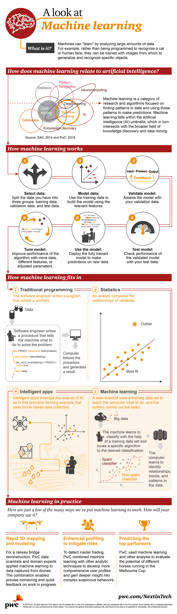
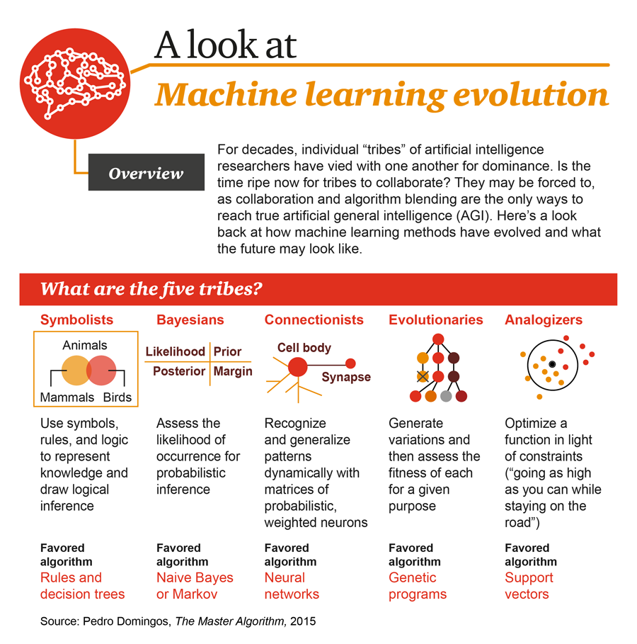
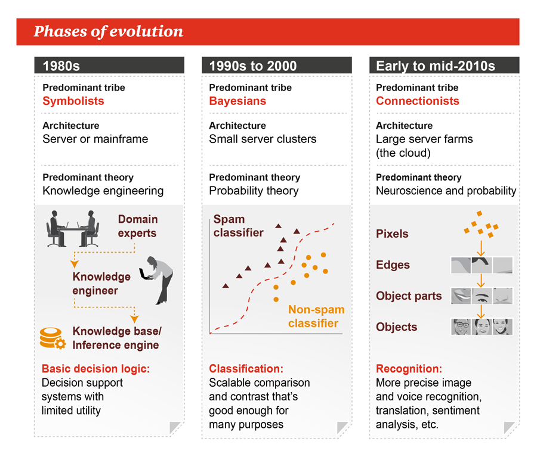
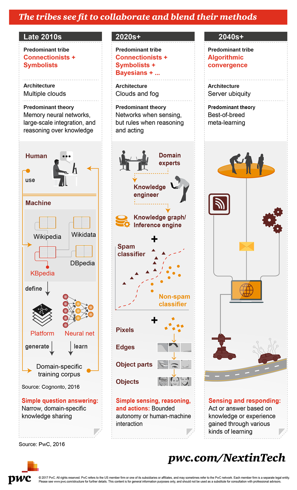
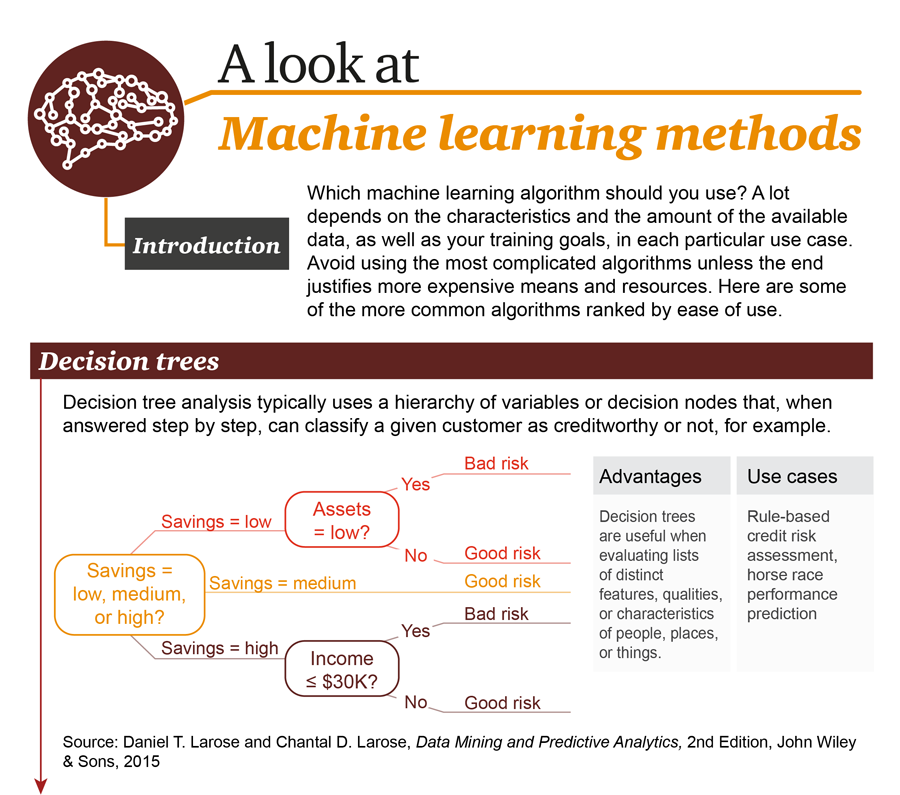
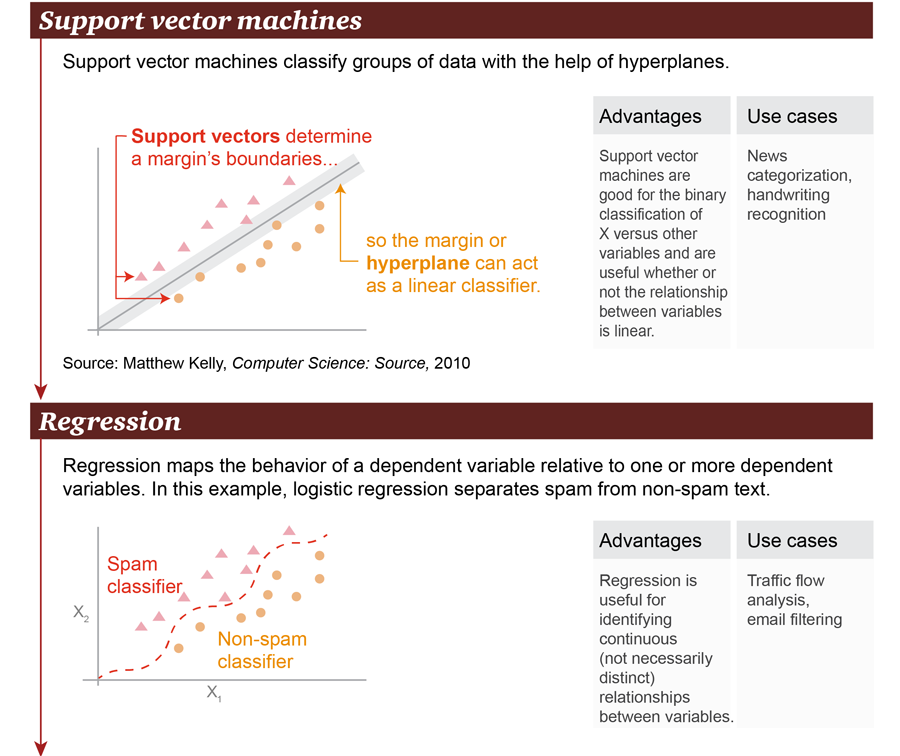
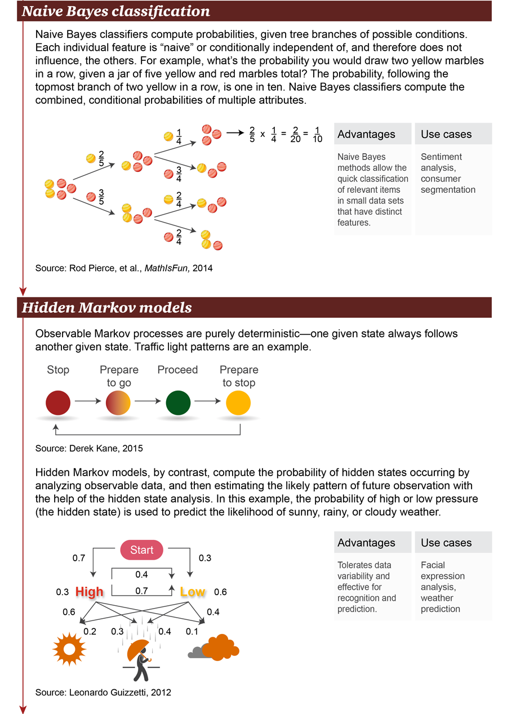
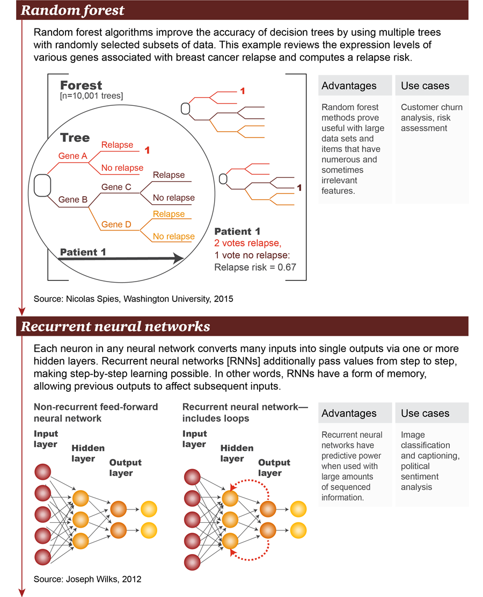
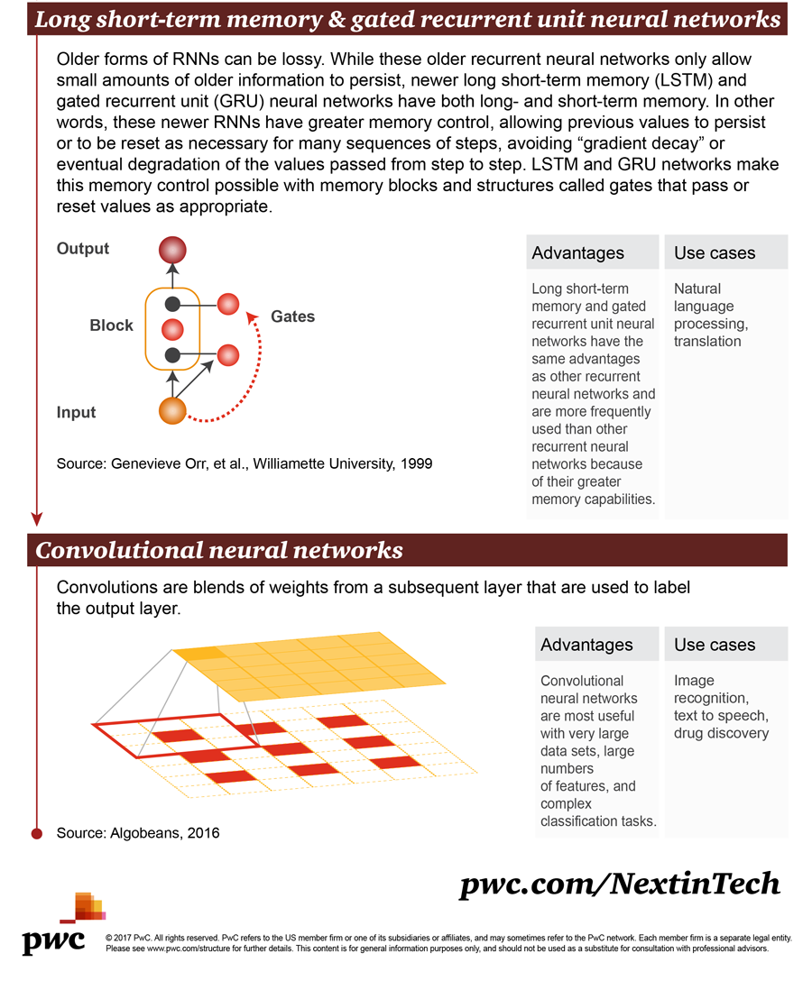

# 🎰 Machine Learning

## 1 Overview

<figure><figcaption>
1.1 Machine Overview
</figcaption></figure>

## 2 Evolution

<figure><figcaption>
2.1 Machine Learning 5 tribes
</figcaption></figure>

<figure><figcaption>
2.2 Machine Learning Phases of evolution
</figcaption></figure>

<figure><figcaption>
2.3 Machine Learning Fit
</figcaption></figure>

## 3 Methods

<figure><figcaption>
3.1 Methods - Decision trees
</figcaption></figure>

<figure><figcaption>
3.2 Methods - SVM and Regression
</figcaption></figure>

<figure><figcaption>
3.3 Methods - NB and HM
</figcaption></figure>

<figure><figcaption>
3.4 Methods - RF and RNN
</figcaption></figure>

<figure><figcaption>
3.1 Methods - LSTM and CNN
</figcaption></figure>
