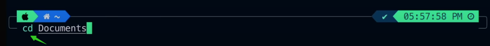

# ⌨ Terminal Beautification

## 1 ZSH

[zsh](https://zsh.sourceforge.io/)

1. Check the shells current available

```bash
cat /etc/shells
```

2. Check the shell currently in use

```bash
echo $SHELL
```

4. Install zsh
5. Switch zsh as default shell

```bash
chsh -s /bin/zsh
```

## 2 Oh-My-Zsh

[Oh-My-Zsh](https://ohmyz.sh/)

```shell
sh -c "$(curl -fsSL https://raw.githubusercontent.com/ohmyzsh/ohmyzsh/master/tools/install.sh)"
```

## 3 Powerlevel10k

[powerlevel10k](https://github.com/romkatv/powerlevel10k)

1. Clone Powerlevel10k

```shell
git clone --depth=1 https://gitee.com/romkatv/powerlevel10k.git ${ZSH_CUSTOM:-$HOME/.oh-my-zsh/custom}/themes/powerlevel10k
```

2. Set `ZSH_THEME="powerlevel10k/powerlevel10k"` in `~/.zshrc`
3. Configuration

```shell
source ~/.zshrc
```

<figure><figcaption><p>3.1 Install Meslo Nerd Font</p></figcaption></figure>

Choice `y` and restart terminal then terminal will configure p10k as shown below

<figure><figcaption><p>3.2 <code>powerlevel10k configure</code></p></figcaption></figure>

Also choice `y` until configure end. restart terminal, our terminal like this

<figure><figcaption><p>3.3 <code>powerlevel10k configure done</code></p></figcaption></figure>

## 4 Plugins

### 4.1 zsh-autosuggestions

[zsh-autosuggestions](https://github.com/zsh-users/zsh-autosuggestions)

1. Clone this repository into `$ZSH_CUSTOM/plugins` (by default `~/.oh-my-zsh/custom/plugins`)

```bash
git clone https://github.com/zsh-users/zsh-autosuggestions ${ZSH_CUSTOM:-~/.oh-my-zsh/custom}/plugins/zsh-autosuggestions
```

2. Add the plugin to the list of plugins for Oh My Zsh to load (inside `~/.zshrc`):

```bash
plugins=( 
    # other plugins...
    zsh-autosuggestions
)
```

3. Start a new terminal session.

### 4.2 zsh-syntax-highlighting

[zsh-syntax-highlighting](https://github.com/zsh-users/zsh-syntax-highlighting)

1. Clone this repository into `$ZSH_CUSTOM/plugins` (by default `~/.oh-my-zsh/custom/plugins`)

```bash
git clone https://github.com/zsh-users/zsh-syntax-highlighting.git ${ZSH_CUSTOM:-~/.oh-my-zsh/custom}/plugins/zsh-syntax-highlighting
```

2. Add the plugin to the list of plugins for Oh My Zsh to load (inside `~/.zshrc`):

```bash
plugins=( 
    # other plugins...
    zsh-syntax-highlighting
)
```

3. Start a new terminal session.

<figure><figcaption><p>4.1 syntax highlighting</p></figcaption></figure>

### 4.3 web-search

1. Add the plugin to the list of plugins for Oh My Zsh to load (inside `~/.zshrc`):

```bash
plugins=( 
    # other plugins...
    web-search
)
```

2. Start a new terminal session. We will google something in terminal.
